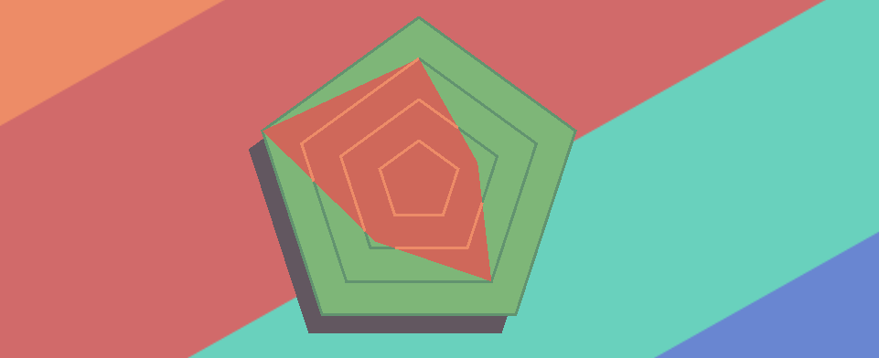
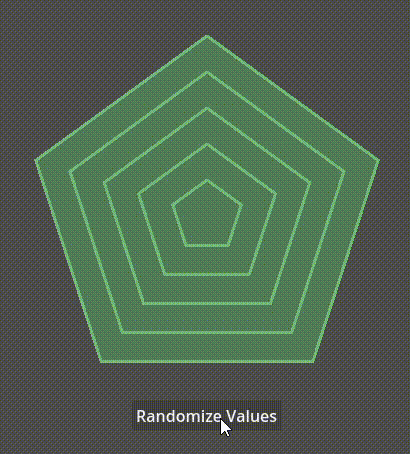

# Godot Radar Graph
- Godot Radar Graph is a script that allows you to easily draw [Radar Graphs](https://en.wikipedia.org/wiki/Radar_chart) which are highly [customizable](#customize) and also supports animation. See the [installation guide](#installation) to get started.



> Replica of the icon created using custom drawing, check out [the code](addons/godot_radar_graph/demos/custom_drawing/icon_graph.gd).


# Installation
Download the files from the [Godot Asset Library](https://godotengine.org/asset-library/asset/3670) or download the latest release.

# Setting Up A Graph
1. Just search for `RadarGraph` while adding a node.
2. Setup the graph using is multitude of options.

# Customize
### Colors
  > [!IMPORTANT]
  > Due to **Godot's Theme** limitations all styling will have to be set using the exported properties.
  - The drawing can be highly customized, from using the ```draw_order``` array to overridding the existing ```_rg_graph_draw_``` functions.
  Checkout the [demos](addons/godot_radar_graph/demos/).
### Fonts
  > [!NOTE]
  > All fonts are different! Be sure to use reliable font's to ensure the script works correctly.
  - Note that fonts also decide the bounding box for it's corrosponding tooltip


> Customized using colors from the Godot Editor.

### Animation
  - All properties in the editor are keyable as well as Tween's. Although using `set(<property_name>)` is supported its still best to use the `set_item_` methods.


> Displaying randomizing the values using a Tween. Check out [the code](addons/godot_radar_graph/demos/animation/tween_example.gd).
